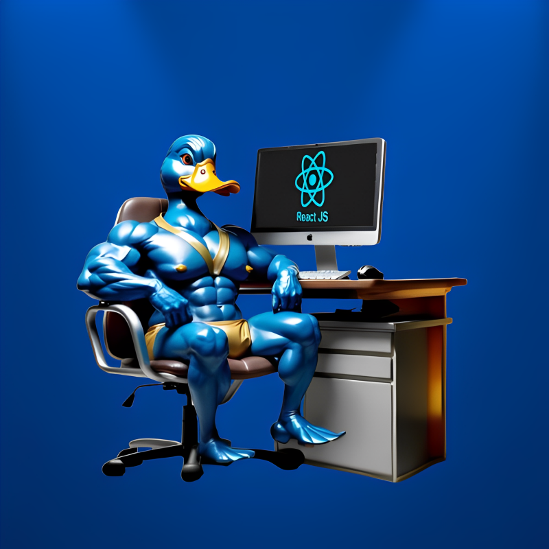

   
  <h1 align="center">Room 3D</h1>

# Sobre o projeto

### Um projeto simples em que coloquei em prática minhas habilidades de modelagem 3D no Blender, explorando também algumas ferramentas de otimização para melhorar o desempenho e a eficiência do modelo.

## Layout

## Front-end:

- React.js
- Vite
- Tailwind CSS
- Blender
- TypeScript

# Autor

## @Duck.Web

<!-- INSTAGRAM -->

